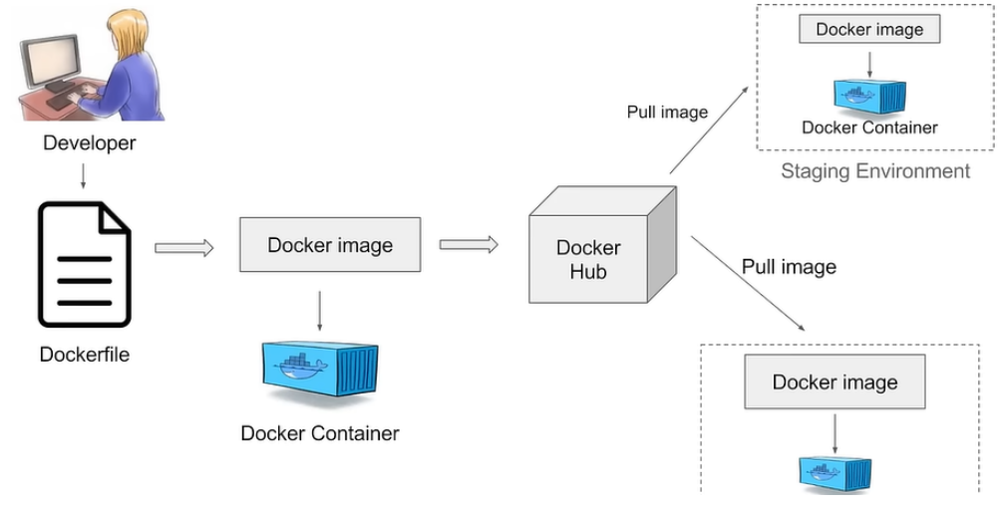

# Luồng chạy cơ bản của Docker

Docker file -> Virtual Machine -> Docker Image -> Docker container

Docker workflow image: 

- Ta có 2 cách để chạy docker:
+ Tạo Dockerfile -> build ra thành 1 Docker Image -> Run docker image -> Container chạy và vào localhost theo port đã cấu hình
+ Tạo file docker-compose.yml -> docker compose up -> Container chạy và vào localhost theo port đã cấu hình

# Dockerfile
B1: Tạo 1 file Dockerfile
B2: Build bằng file Dockerfile để tạo ra Docker Image (VD: docker build -t my_image:1.0.0 .)
B3: Chạy Docker Image -> Khởi tạo ra 1 container của image (VD: docker run --name demo_container -d -p 80:80 -rm my_image:1.0.0)

# Docker compose file
B1: Tạo 1 file docker-compose.yml
B2: Cấu hình trong file docker-compose.yml
B3: Chạy lệnh docker compose up để chạy file docker-compose.yml -> Chạy ra số container theo cấu hình trong services

* Ở đây ta có thể chọn 2 cách để build ra 1 container chạy:
1, Điền image (VD: image: odoo:17.0 -> Lên Dockerhub tìm đến image odoo với version 17.0 và pull về chạy)
2, Điền dockerfile
VD:
    build:
      context: . (Lấy theo context của file hiện tại, "." tìm Dockerfile là toàn bộ thư mục hiện tại của file docker-compose.yml)
      dockerfile: Dockerfile
-> Lên Dockerhub tìm đến image odoo với version được cấu hình trong FROM và pull về chạy
-> Ngoài ra khác biệt khi chạy Dockerfile đấy là bên cạnh việc pull image về và chạy thì nó còn chạy các lệnh đã được
cấu hình sẵn trong Dockerfile

# Docker Volume (Persist Data)
- Vấn đề:
+ Khi không cấu hình docker volume thì mỗi khi làm việc với dữ liệu trong database như CRUD, những dữ liệu trong database
sẽ chỉ lưu bên trong container, và mỗi khi ta build lại container đều sẽ khiến container đó bị mất dữ liệu.

- Cách giải quyết:
+ Volume được sinh ra để giải quyết vấn đề đó, volume dùng để lưu data của container ra bên ngoài container, điều này
+ giúp cho mỗi lần xóa container và build lại một container mới sẽ giúp giữ được data cũ thông qua volume.
+ Data sẽ chỉ mất khi ta xóa volume của container đi.

Cách 1: Tạo volume qua CLI
B1: Tạo một volume tên là todo-db (docker volume create todo-db -> lệnh này sẽ tạo một thư mục trong /var/lib/docker/volumes)
B2: Build container từ image và mount container với volume đã được tạo để có thể lấy, cập nhật hoặc tạo dữ liệu trên
volume có sẵn trước đó.

Cách 2: Tạo volume thông qua file docker-compose.yml
B1: Khai báo volume trong các container nằm trong services của file. (bao gồm tên thư mục và đường dẫn đến thư mục đó)
B2: Khai báo volume ở bên ngoài services, và set driver là local (điều này nghĩa là volume sẽ được tạo khi build container, 
và sẽ được lưu theo địa chỉ là local -> Từ đó, sẽ tự động mount folder trong container với volume bên ngoài).

# Docker Network
- Vấn đề:
+ Một bài toán được đề ra là tạo ra 2 container là web và database, nhưng bản chất của các container là sự độc lập, riêng lẻ,
không liên quan, không thể nói chuyện, tương tác với những thứ bên ngoài. Vậy làm thế nào để 2 container có thể kết nối
hoặc nói chuyện được với nhau?

- Cách giải quyết:
+ Ta sẽ sử dụng network để 2 hoặc nhiều container có thể nói chuyện và tương tác với nhau thông qua việc sử dụng chung 1 network.

# Docker compose
- Vấn đề:
+ Quy trình thông thường để build ra 1 container đó là ta viết Dockerfile để build ra 1 image hoặc pull image từ Dockerhub
về, sau đó chạy lệnh nhiều lần để build ra đc 2 image và 2 container web và db, chưa kể ta còn phải cấu hình các container
liên quan sử dụng chung 1 network, và các biến môi trường,... => Tốn rất nhiều thời gian, thao tác chạy lệnh, maintain khó.

- Cách giải quyết:
+ Ta sẽ sử dụng docker-compose, dễ hiểu thì đây là một file có thể dung hợp lại tất cả các bước thao tác trên trong 
1 file và chạy => Tối ưu, dễ maintain và không tốn nhiều thao tác chạy lệnh, minh bạch, nhìn trực quan,...

- Những thành phần trong file docker-compose.yml
+ version: Đây không phải phiên bản của Docker hay Docker compose, mà đây là phiên bản của file compose format, khi điền
một phiên bản thì khi build docker sẽ đọc ra được version đã được định nghĩa riêng của docker, và sử dụng docker engine
tương ứng để build.
+ 
